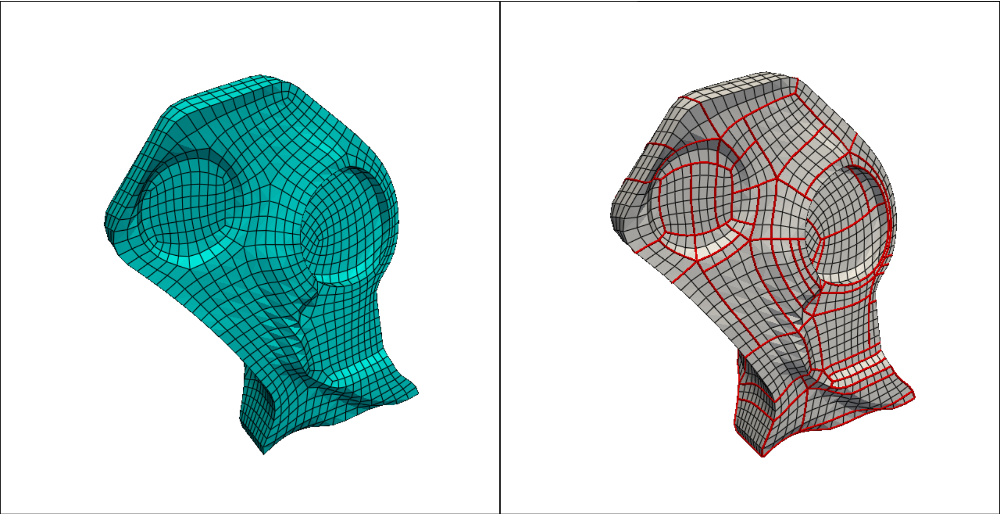

# MotorCycleGraph
A Python implementation of MotorCycle Graph algorithm for Quad-Mesh partitioning

This is a Python project for partitioning a Quad-Mesh using the MotorCycleGraph algorithm published by Eppstein et al. (2008). You can find the original paper at the following link:

https://disneyanimation.com/publications/motorcycle-graphs-canonical-quad-mesh-partitioning

## Dependencies

Before running the project, ensure you have the following dependencies installed:

- Python 3.8+
- NumPy
- Matplotlib
- pyvista

You can install these dependencies using `pip`:

```bash
pip install numpy matplotlib pyvista
```
## How to use
To use the code, you need to run "Motor.py" following the path to a quad-mesh you wish to partition it:
```bash
python Motor.py <path to your quad mesh>
```
The code will process the mesh and show the input mesh and the result of the MotorCycleGraph algorithm side-by-side.

## Usage example
Here is an example of code for partitioning a quad mesh:

```bash
python Motor.py ./models/6_rem_p0_0_quadrangulation_smooth.obj
```

Below is a screenshot of the output. The left image is the initial quad-mesh, and the right image is the partitioned quad-mesh by MotorCycleGraph.



